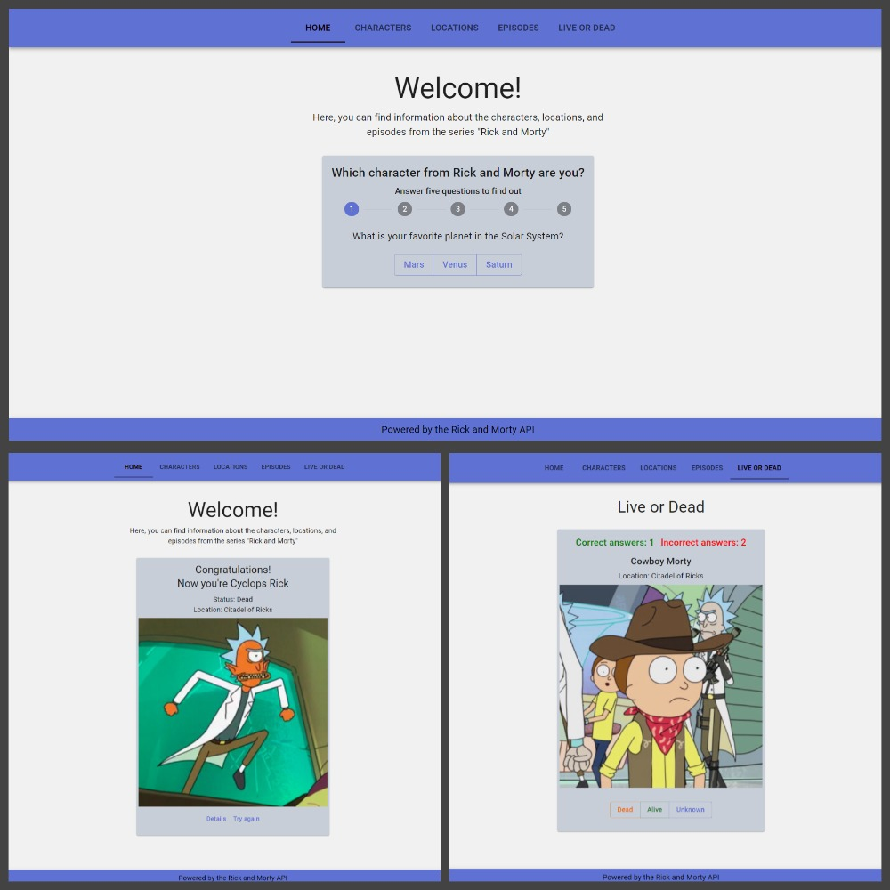
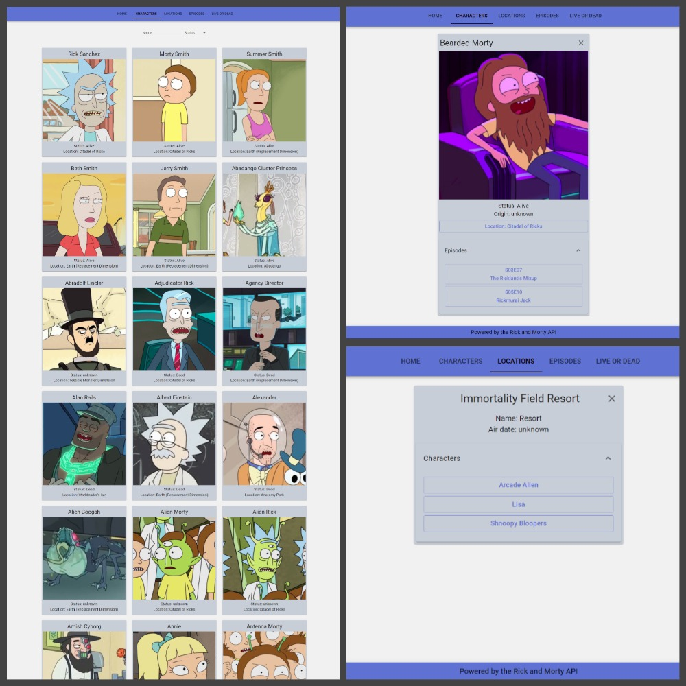
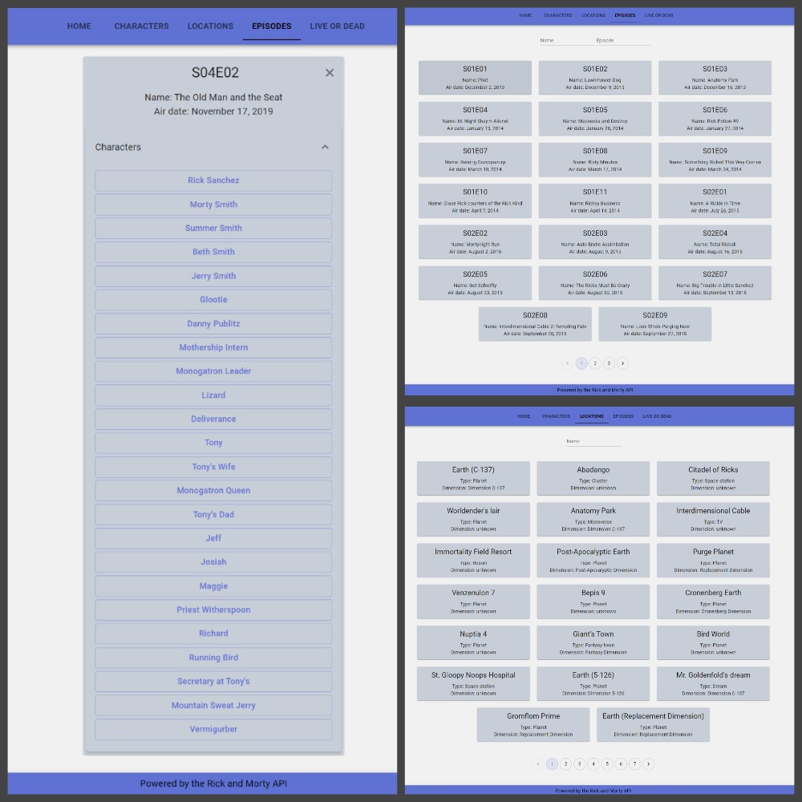
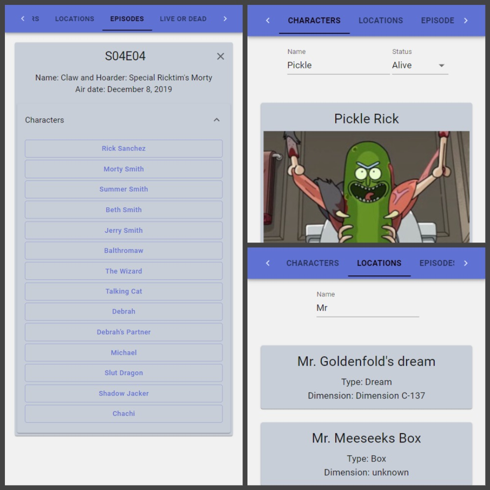

# "Rick and Morty" Application Using React.js, TypeScript, RTK Query, GraphQL, Material-UI

## Description

The "Rick and Morty" application provides information about characters, locations, and episodes from the universe of the popular animated series "Rick and Morty". It also includes two mini-games: "Alive or Dead" to test your knowledge of the series, and "Who Are You in Rick and Morty's Universe".

## Technologies and Tools

The application is developed using the following technologies and tools:

- React: JavaScript library for building user interfaces.
- TypeScript: Statically typed programming language used with React to enhance reliability and development support.
- RTK Query: Library for working with server data.
- GraphQL: Query language that allows retrieving only the required data from the server.
- Material-UI: Component library for creating user interfaces.
- Additional packages: qs, react-router-dom v6, graphql-request, @rtk-query/graphql-request-base-query.

## Interface Screenshots

## Installation

To install and run the application, follow these steps:

1. Clone the repository to your local machine.
2. Ensure that you have Node.js installed.
3. Navigate to the project directory in your terminal and run the command `npm install` to install all the dependencies.
4. After successful installation, execute the command `npm start` to launch the application in development mode.
5. Open your browser and visit `http://localhost:3000` to see the application in action.

### Characters

The characters page allows you to view a list of all the characters from the "Rick and Morty" animated series. You can apply filters to the characters based on parameters such as name, status (alive/dead), species, and other characteristics. Clicking on a specific character will provide you with detailed information, including their image, name, status, species, location, and the episodes they have appeared in.

### Locations

The locations page displays a list of all the locations featured in the animated series. You can access information about each location, such as its name, type, dimension, description, and the associated characters.

### Episodes

The episodes page presents a list of all the episodes from "Rick and Morty". You can explore details for each episode, including its name, episode number, air date, and the characters appearing in that episode.

### Mini-Games

In addition to character, location, and episode information, the application offers two mini-games:

- "Who Are You in Rick and Morty's Universe?": In this game, you will answer a series of questions to determine which character from the animated series best matches your personality.
- "Alive or Dead?": This game presents characters from "Rick and Morty", and your task is to determine whether they are alive or dead.

## Notes

- Before using the application, ensure that you have all the dependencies and components listed in the package.json file installed.
- The application requires an internet connection to retrieve data from an external source.
- The application is developed solely for entertainment purposes and has no commercial intent.

## Acknowledgments

- "Rick and Morty" - an animated series created by Justin Roiland and Dan Harmon. We express gratitude to them for creating this amazing universe!
- Special thanks to [Rick and Morty API](https://rickandmortyapi.com/documentation) - an API that provides data about characters, locations, and episodes from the "Rick and Morty" series. We appreciate their provision of access to this data, as well as the React, TypeScript, Redux, GraphQL, and Material-UI developer communities for providing powerful tools to create this application.

## Contact

If you have any questions, suggestions, or feedback, please contact me at [mikhail.bugrov.v@gmail.com](mailto:mikhail.bugrov.v@gmail.com)